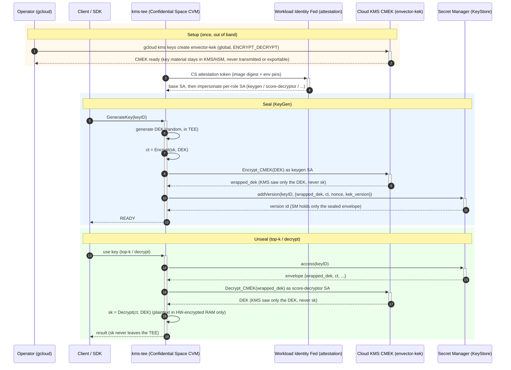

# enVector GCP-native KMS Backend: Deploy, Operate, and Use

A source-grounded, copy-paste-ready guide for standing up enVector with the
GCP-native KMS backend from scratch, launching the attested `kms-tee`, and running
an SDK insert/search end-to-end. It walks the full path in order:
**Prerequisites -> Digest allowlist -> Install (Terraform) -> Configure + Launch ->
Verify / SDK e2e -> Operate -> Troubleshooting**.

The deployment target is **GKE via the in-repo Helm chart** for the MSA stack and the KMS
control plane; `kms-tee` stays on an attested Confidential Space CVM, which no Kubernetes
pod can substitute for (see 1.5.1). Appendix A covers the single-host `docker-compose`
path, for quick verification only.

## Overview

The GCP-native KMS backend runs the enVector KMS on Google Cloud with a *managed*
secret backend instead of a self-hosted Vault, while keeping the customer FHE secret key
(`sk`) out of the reach of any *single* Google service. No one managed service — Cloud KMS
or Secret Manager — can read `sk` on its own. A **residual separation-of-duties assumption**
remains: a provider that both observes the plaintext DEK at Cloud KMS (presented on every
wrap/unwrap) *and* reads the stored envelope (`ct`) from Secret Manager could correlate them
to reconstruct `sk`. Fully eliminating that residual requires a KEK the provider does not
operate (customer-hosted HSM / external key manager). See the design's Security Analysis
(§6, "Residual: colluding provider"). It composes three GCP primitives
:

- **Cloud KMS (CMEK) as the KEK / wrapper.** A customer-managed encryption key wraps a
  local per-key DEK. Cloud KMS only ever sees the opaque DEK, never `sk`.
- **Secret Manager as the KeyStore.** It holds only the sealed envelope
  (`{alg, wrapped_dek, ct, nonce, key_label, kek_version}`, ~1.2 KB) — an opaque
  ciphertext, never the DEK plaintext or `sk`.
- **An attested Confidential Space `kms-tee`.** Plaintext `sk` exists only transiently,
  inside the hardware-encrypted RAM of the attested CVM, during keygen and top-k score
  decrypt. It exists nowhere else.

Two services split the work. The `envector-kms` **control plane** runs as an ordinary GKE
pod, holds **no** GCP credentials and never touches `sk`; it
handles the API, JWT/RBAC, and tenant/key-scope enforcement. The `envector-kms-tee`
runs inside Confidential Space and is the only principal that can both read the Secret
Manager envelope and invoke the Cloud KMS unwrap — so only it can reconstruct `sk`. The
two talk over an internal gRPC **service** channel (`:50062`, seal/unseal/rotate traffic —
not the attestation path, which is the separate Workload Identity Federation flow); in
production the enVector search platform and the KMS should live in **separate network
boundaries** (independent trust domains — the KMS authorizes every request itself, so an
enVector-side compromise grants no key access). **Note:** the GKE deployment in Section 4.3
puts the MSA stack and the control plane in **one** cluster with KMS auth defaulted off, and
Appendix A's compose e2e merges everything onto one bridge network — neither provides that
isolation on its own. Treat network separation (a separate cluster/namespace with
NetworkPolicy, and `kms.auth.enabled=true`) as a production requirement to add on top. Whether that
`:50062` link is mTLS is deployment-configured, not fixed by platform: where `kms-tee` runs
co-located with its mTLS material wired (e.g. Appendix A's compose stack via `cert-init`; a
Kubernetes deployment provisioning the same certs via `kms.tee.mtls.*`), the link is mTLS. In this guide's
**external attested Confidential Space CVM** topology the CVM's `:50062` is **plaintext
today**, isolated by a firewall rule, with attestation-bound mTLS (the certs gated by
attestation) a planned follow-up not yet in effect (see Section 4.3).

The trust model is attestation-gated identity federation. Confidential Space issues a
Google-signed attestation token carrying the workload's measured image digest. A
dedicated Workload Identity Pool provider admits that token only if its
`attribute_condition` matches an allowlisted image digest (plus project number, runner
SA, non-debug, `STABLE` support, and every pinned launch env var). A matching token
federates into a single **base SA**, which in turn is allowed to impersonate **five
per-role SAs** (keygen / rotate / key-info / score-decryptor / metadata-cipher), each
carrying only the least-privilege Cloud KMS + Secret Manager IAM its role needs. A
tampered image, a non-attested VM, or a digest that is not `active` in the manifest
fails the condition and never obtains any SA — key operations fail closed.

```
                         ATTESTATION-GATED IDENTITY CHAIN

   Confidential Space CVM (kms-tee)
      |  Google-signed attestation token  (image_digest, project, non-debug, STABLE)
      v
   Workload Identity Pool provider   -- attribute_condition pins digest + env --
      |  federate (only if condition matches)
      v
   base SA  (ek-tee-attested-*)      -- NO direct SM/KMS data-plane roles --
      |  roles/iam.serviceAccountTokenCreator on each of 5 per-role SAs
      v
   +----------------+----------------+-----------------+------------------+
   keygen SA        rotate SA        key-info SA       score-decryptor SA   metadata-cipher SA
   KMS encrypt+get  KMS enc/dec+ver  (no Cloud KMS)    KMS decrypt          KMS decrypt (meta key)
   SM create/add    SM read/write    SM list+access    SM access            SM access
```

### Key seal / unseal flow (DEK envelope)

How `sk` is sealed on KeyGen and reconstructed on use. The customer-managed Cloud KMS
CMEK (`envector-kek`) wraps only a local DEK; Secret Manager holds only the sealed
envelope; plaintext `sk` exists only inside the attested CVM. No single Google service
sees `sk` — recovering it needs both the Secret Manager envelope and a Cloud KMS unwrap,
and only the attested `kms-tee` can do both.



Rotation (`Rotate`) advances the Cloud KMS CMEK version and re-wraps only `wrapped_dek`
under the new version; `ct` is unchanged, so rotation is cheap. Disabling or destroying the
CMEK is a customer-controlled kill switch `kms-tee` cannot override (it holds only
Encrypt/Decrypt, never CMEK admin). **Caveat:** disable/destroy state is **per
CryptoKeyVersion**, and after rotations envelopes may still reference older versions (rotate
reseals only the touched key). To make *every* envelope undecryptable you must enumerate and
disable/destroy **every enabled version**, not just the primary/latest.

### Scope

This guide covers the enVector GCP-native KMS backend: Cloud KMS (CMEK) as the KEK, Secret
Manager as the KeyStore, and an attested Confidential Space CVM as the only holder of
plaintext `sk`.

Deployment topology throughout (the external-TEE model): an attested Confidential Space CVM
runs `kms-tee` (the only holder of `sk`); a **GKE cluster in the same VPC** runs the
6-service MSA stack plus the `envector-kms` control plane (which holds no GCP credentials) as
pods, wired to the CVM's plaintext `:50062`; the SDK client drives the endpoint `:50050` and
the control-plane gRPC. GKE nodes are already in-VPC, so there is no bastion or stack VM —
you run `helm`/`kubectl` from your own machine.

---

## 1. Prerequisites

Install these before starting. The last column says where each one is first needed, so you can
install as you go — but `gcloud` is required from 1.1 onward, and `kubectl` plus its GKE auth
plugin from 1.5.

| Tool | Install | First needed |
|---|---|---|
| `gcloud` (Google Cloud CLI) | [cloud.google.com/sdk/docs/install](https://cloud.google.com/sdk/docs/install) | 1.1 |
| `kubectl` | [kubernetes.io/docs/tasks/tools](https://kubernetes.io/docs/tasks/tools/) — or `gcloud components install kubectl` | 1.5 |
| `gke-gcloud-auth-plugin` | [cluster-access-for-kubectl#install_plugin](https://cloud.google.com/kubernetes-engine/docs/how-to/cluster-access-for-kubectl#install_plugin) | 1.5 |
| `terraform` | [developer.hashicorp.com/terraform/install](https://developer.hashicorp.com/terraform/install) | 3.1 |
| `helm` (>= 3.8) | [helm.sh/docs/intro/install](https://helm.sh/docs/intro/install/) | 4.3 |
| `docker` (with `buildx`) | [docs.docker.com/engine/install](https://docs.docker.com/engine/install/) — `buildx` ships with it | 2.1 |
| `jq` | [jqlang.github.io/jq/download](https://jqlang.github.io/jq/download/) | 2.2 |
| `git` | [git-scm.com/downloads](https://git-scm.com/downloads) | to obtain this repository |
| `openssl` | preinstalled on macOS and most Linux distributions | 4.4 |
| `python3` + `pip` | [python.org/downloads](https://www.python.org/downloads/) | 5.3 |

No specific versions are pinned beyond `helm >= 3.8` and `kubectl >= 1.26` (which is what
makes the auth plugin mandatory: without it every `kubectl` call fails even though
`get-credentials` reported success). `docker` is needed only to publish the `kms-tee`
image (2.1) and to run the SDK e2e container (5.2), not to run the stack itself.

Two things are easy to miss because they are configuration rather than packages, and both are
covered in 1.6: the **operator IAM roles** these steps need, and the **Application Default
Credentials** Terraform authenticates with.

### 1.0 Example names and shell variables

Every resource this guide creates carries `NAME_SUFFIX`, so a rerun — or a colleague's
parallel deployment on the same project — only needs a fresh suffix, not per-name edits.
Names marked "MUST match" have to be identical across the two Terraform modules and the CVM
launcher, or attestation federation fails closed; 3.1 and 4.1 derive them from these same
exports, which is what guarantees that. Re-run this block in any new shell — every later
section reads these variables.

> ⚠️ **On a shared project, never run without a suffix that is yours alone.** The module
> defaults (`envector-kms`, `es2-images`, `envector-kms-vpc`) are exactly the names a
> colleague already used: `gcloud` reports "already exists", you silently continue against
> their keyring, image repository or VPC — and your later teardown takes their resources
> with it. And use a **fresh** suffix per rerun: GCP soft-deletes SAs (~30 days) and custom
> roles (~7 days), so a torn-down suffix's names stay reserved. The one permanent cost is
> the keyring — GCP keyrings **cannot be deleted**, so each suffix leaves its keyring behind.

```bash
# Example values — replace with your org's project / region.
export PROJECT_ID=my-gcp-project
export REGION=asia-northeast3
export ZONE=asia-northeast3-a

# One suffix for everything this run creates. Lowercase letters and digits only (it lands
# in custom-role ids, which reject hyphens), at most 11 characters (SA account-ids cap
# at 30). Everything below derives from it.
export NAME_SUFFIX=alice1

# The KMS_* values below are Cloud KMS resource NAMES (identifiers), NOT secret
# values — the key material never leaves Cloud KMS. (The backend also needs an
# enVector license token, but that is supplied from a token.jwt FILE mounted into
# the container; ENVECTOR_LICENSE_TOKEN is just the in-container path to it, not
# the token value — see Section 4.3. Do not put the token value in env/config.)
export KMS_KEYRING="envector-kms-${NAME_SUFFIX}"           # CMEK keyring name — MUST be location=global
export KMS_KEY="envector-kek-${NAME_SUFFIX}"               # CMEK name; wraps the per-key DEK (ENCRYPT_DECRYPT)
export KMS_KEY_METADATA="envector-meta-kek-${NAME_SUFFIX}" # optional per-type metadata CMEK name (same keyring)

export AR_LOCATION=asia-northeast3
export AR_REPOSITORY="es2-images-${NAME_SUFFIX}"           # Artifact Registry (Docker) repo

export SECRET_PREFIX="envector-kms-${NAME_SUFFIX}"         # MUST match kms-iam + kms-wif + launcher
export NETWORK="envector-kms-vpc-${NAME_SUFFIX}"
export SUBNET="envector-kms-subnet-${NAME_SUFFIX}"
export SUBNET_RANGE=10.10.0.0/24

export GKE_CLUSTER="envector-gke-${NAME_SUFFIX}"           # runs the MSA stack + the KMS control plane
export GKE_POD_RANGE=10.20.0.0/16         # subnet secondary range for pods — the :50062 firewall source (4.2)
export GKE_SVC_RANGE=10.30.0.0/20         # subnet secondary range for Services
export K8S_NAMESPACE="envector-${NAME_SUFFIX}"
```

### 1.1 Enable the required GCP APIs

```bash
# standard GCP provisioning — adjust project/region/names to your org
gcloud services enable \
  secretmanager.googleapis.com \
  cloudkms.googleapis.com \
  iamcredentials.googleapis.com \
  sts.googleapis.com \
  iam.googleapis.com \
  confidentialcomputing.googleapis.com \
  compute.googleapis.com \
  container.googleapis.com \
  artifactregistry.googleapis.com \
  iap.googleapis.com \
  cloudresourcemanager.googleapis.com \
  --project="$PROJECT_ID"
```

`iamcredentials.googleapis.com` is required for the per-role SA impersonation (tokens are
minted through it); `cloudresourcemanager.googleapis.com` is required because both
Terraform modules read the project number via `data.google_project`. Expected output:
`Operation ... finished successfully.`

### 1.2 Create the CMEK keyring + key — MUST be the `global` location

> **`ENVECTOR_KMS_GCP_KMS_KEY` / `_KMS_KEYRING` / `_KMS_GCP_PROJECT` are resource NAMES,
> not secrets.** They identify *which* Cloud KMS key to use; the key material never
> leaves Cloud KMS (see the Overview seal/unseal flow). It is safe to commit them to
> env/tfvars and they are attestation-pinned so a tampered launch cannot point `kms-tee`
> at a different key. Never place secret values in these — the only secret the backend
> needs is `ENVECTOR_LICENSE_TOKEN`, kept in Secret Manager.

The Terraform modules **reference** the keyring and key (data sources); they never create
them, and the plan fails if they are absent. Create them out of band. The keyring **must**
be in the `global` location — a regional keyring fails the first seal with `NOT_FOUND`, and
a Confidential Space CVM cannot be fixed in place (the keyring would have to be recreated).
The key purpose must be `encryption` (symmetric ENCRYPT_DECRYPT).

```bash
gcloud kms keyrings create "$KMS_KEYRING" \
  --location=global \
  --project="$PROJECT_ID"

gcloud kms keys create "$KMS_KEY" \
  --location=global --keyring="$KMS_KEYRING" \
  --purpose=encryption \
  --project="$PROJECT_ID"
```

**Optional per-type CMEK split.** To wrap the vector-metadata DEK under a *dedicated*
second key in the **same** keyring, create it too and set `kms_key_metadata` /
`ENVECTOR_KMS_GCP_KMS_KEY_METADATA`. Enabling the split is **greenfield-only**: a namespace
that already ran single-CMEK has metadata envelopes that become undecryptable under a new
key.

```bash
# Optional: only if you want a dedicated metadata CMEK (greenfield namespaces only).
gcloud kms keys create "$KMS_KEY_METADATA" \
  --location=global --keyring="$KMS_KEYRING" \
  --purpose=encryption \
  --project="$PROJECT_ID"
```

### 1.3 Create the Artifact Registry (Docker) repo

Image refs read `${AR_LOCATION}-docker.pkg.dev/<project>/${AR_REPOSITORY}/envector-kms-tee`.
The suffixed repo name differs from the module default (`es2-images`), which is why 3.1's
tfvars passes `ar_location` / `ar_repository` explicitly — the runner SA's image-pull
reader binding must land on this repo.

```bash
gcloud artifacts repositories create "$AR_REPOSITORY" \
  --repository-format=docker \
  --location="$AR_LOCATION" \
  --project="$PROJECT_ID"
```

### 1.4 Dedicated VPC + subnet + Private Google Access + Cloud NAT

Use a **dedicated VPC + subnet** — never the default network. The CVM's `kms-tee` gRPC
listener `:50062` is **plaintext**, and the default VPC's `default-allow-internal` rule
would expose it VPC-wide. Turn on Private Google Access so a `--no-address` CVM can reach
STS / IAM / Secret Manager / Cloud KMS / Artifact Registry over private Google endpoints,
and add a Cloud NAT for the CVM's remaining egress. The same Private Google Access + NAT
also serve the private GKE nodes created in 1.5.

The subnet carries two **secondary ranges** because the GKE cluster is VPC-native
(alias IP): pods and Services get their addresses from them. The pod range is not just GKE
plumbing — it is the source range the Section 4.2 firewall rule allows to reach `:50062`.

```bash
# Dedicated VPC (custom subnet mode).
gcloud compute networks create "$NETWORK" \
  --subnet-mode=custom \
  --project="$PROJECT_ID"

# Subnet with Private Google Access ON + the pod/Service secondary ranges GKE needs.
gcloud compute networks subnets create "$SUBNET" \
  --network="$NETWORK" --region="$REGION" \
  --range="$SUBNET_RANGE" \
  --secondary-range="pods=${GKE_POD_RANGE},services=${GKE_SVC_RANGE}" \
  --enable-private-ip-google-access \
  --project="$PROJECT_ID"

# Cloud Router + NAT for egress from a --no-address CVM.
gcloud compute routers create "envector-kms-router-${NAME_SUFFIX}" \
  --network="$NETWORK" --region="$REGION" \
  --project="$PROJECT_ID"

gcloud compute routers nats create "envector-kms-nat-${NAME_SUFFIX}" \
  --router="envector-kms-router-${NAME_SUFFIX}" --region="$REGION" \
  --nat-all-subnet-ip-ranges --auto-allocate-nat-external-ips \
  --project="$PROJECT_ID"
```

### 1.5 GKE cluster (MSA stack + control plane)

Everything except `kms-tee` runs as pods in a **VPC-native, private-node** GKE cluster in
the *same VPC* as the CVM, so the control plane reaches the CVM's private `:50062` with no
bastion in between. Drive it with `helm`/`kubectl` from your own machine.

```bash
# standard GCP provisioning — adjust machine type / node count to your workload
gcloud container clusters create "$GKE_CLUSTER" \
  --project="$PROJECT_ID" --region="$REGION" \
  --network="$NETWORK" --subnetwork="$SUBNET" \
  --enable-ip-alias \
  --cluster-secondary-range-name=pods \
  --services-secondary-range-name=services \
  --enable-private-nodes --master-ipv4-cidr=172.16.0.0/28 \
  --enable-master-authorized-networks \
  --master-authorized-networks="$(curl -s ifconfig.me)/32" \
  --workload-pool="${PROJECT_ID}.svc.id.goog" \
  --node-locations="$ZONE" \
  --machine-type=e2-standard-8 --num-nodes=1

gcloud container clusters get-credentials "$GKE_CLUSTER" \
  --region="$REGION" --project="$PROJECT_ID"
```

- `--enable-private-nodes` leaves the nodes without external IPs; they pull images and
  reach Google APIs through the Private Google Access + Cloud NAT from 1.4.
- `--master-authorized-networks` is what lets your machine reach the cluster control plane.
  Re-run `gcloud container clusters update "$GKE_CLUSTER" --region="$REGION"
  --master-authorized-networks=<cidr>` when your egress IP changes, or add your VPN range.
- `--workload-pool` is required only for the optional **in-cluster TEE dev mode**
  (`kms.tee.mode=in-cluster`, 4.3). The production external-TEE path puts **no** GCP
  identity on any pod.
- `--node-locations` pins the nodes to one zone, so `--num-nodes=1` means one node.
  Without it a `--region` cluster reads `--num-nodes` as *per zone* and you get three.
  Drop it (and raise the count) when you want the nodes spread for availability; the
  control plane stays regional either way.
- Size the node pool for the MSA stack, not the KMS: `envector-compute` alone requests
  ~3 GiB and the KMS control plane ~512 MiB. One `e2-standard-8` carries the whole
  stack plus the KMS.

The KMS control plane holds no GCP credentials and never sees `sk`, so it needs neither
Confidential Computing nor a Workload Identity binding.

#### 1.5.1 Why `kms-tee` does not move into the cluster

The attestation this design depends on is a *Confidential Space runtime* property: CS issues
a Google-signed token carrying the measured image digest and the container's environment,
and the WIF provider admits only that token shape. An ordinary GKE pod cannot produce it, so
it can never obtain the base SA — key operations would fail closed. (Confidential GKE Nodes
encrypt VM memory but do not emit the Confidential Space attestation token this provider
pins; whether they could ever substitute is a separate evaluation.)

So the GKE pivot removes the **stack VM**, not the CVM. `kms-tee` keeps running on the
attested Confidential Space VM launched in Section 4.1.

### 1.6 Operator IAM, tooling, and CVM capacity

- **Operator IAM.** The two Terraform modules create service accounts, **project-level
  custom roles**, project/crypto-key/Artifact-Registry IAM bindings, and a Workload Identity
  pool + provider. Being able to create the CMEK keyring is not enough — granting IAM *on*
  it is a separate permission. On a shared project, ask for:

  | Grant | Scope | Needed for |
  |---|---|---|
  | `roles/iam.serviceAccountAdmin` | project | the 7 SAs (5 per-role + base + runner) |
  | `roles/iam.roleAdmin` | project (cannot be narrowed) | the 6 `google_project_iam_custom_role`s |
  | `roles/resourcemanager.projectIamAdmin` | project | the 10 project IAM members |
  | `roles/cloudkms.admin` | the CMEK keyring | the 12 crypto-key IAM members |
  | `roles/artifactregistry.admin` | the image repo | the runner SA's reader binding |
  | `roles/iam.workloadIdentityPoolAdmin` | project | the pool + attested provider (3.1) |
  | `roles/compute.instanceAdmin.v1` + `roles/iam.serviceAccountUser` on the runner SA | project / that SA | launching the CVM (4.1) |

  Check what you hold before starting:

  ```bash
  curl -s -X POST -H "Authorization: Bearer $(gcloud auth print-access-token)" \
    -H "Content-Type: application/json" \
    -d '{"permissions":["iam.roles.create","iam.serviceAccounts.create",
         "resourcemanager.projects.setIamPolicy","iam.workloadIdentityPools.create",
         "cloudkms.cryptoKeys.setIamPolicy","artifactregistry.repositories.setIamPolicy"]}' \
    "https://cloudresourcemanager.googleapis.com/v1/projects/${PROJECT_ID}:testIamPermissions"
  ```

  Only the permissions you hold come back; anything absent from the response is missing. If
  the project owner will not grant `roles/iam.roleAdmin`, a **dedicated throwaway project**
  is the cleaner path — it also avoids the 7-day custom-role and 30-day SA soft-delete
  collisions on re-runs.
- **Operator IAM (GKE):** additionally `roles/container.admin` (or equivalent) to create the
  cluster and fetch credentials.
- **Terraform credentials (ADC).** The Google provider authenticates through Application
  Default Credentials, which `gcloud auth login` does **not** create — that only logs in the
  `gcloud` CLI itself. Without ADC both modules fail before any plan with
  `Attempted to load application default credentials ... No credentials loaded`, plus a
  misleading `Invalid provider configuration` alongside it. Run once:

  ```bash
  gcloud auth application-default login   # add --no-launch-browser on a headless host
  gcloud auth application-default set-quota-project "$PROJECT_ID"
  ```
- **Confidential Space capacity** in the target zone: SEV needs an `n2d`-family machine;
  TDX needs a `c3`-family machine.

### 1.7 Prepare the container images

Building and publishing the enVector images is outside the scope of this guide — obtain
them from your enVector release (the images your build/release pipeline produces). The
deployment only requires that they are **available in a container registry it can pull**
and that you reference each one by name and tag.

Point the chart (Section 4.3) at the images through these Helm values — the image name in
`*.image.repository`, the release tag in `*.image.tag`:

| Component | Helm value (image) | Helm value (tag) |
|---|---|---|
| endpoint | `endpoint.image.repository` | `endpoint.image.tag` |
| backend | `backend.image.repository` | `backend.image.tag` |
| orchestrator | `orchestrator.image.repository` | `orchestrator.image.tag` |
| compute | `compute.image.repository` | `compute.image.tag` |
| shaper | `shaper.image.repository` | `shaper.image.tag` |
| kms (control plane) | `kms.image.repository` | `kms.image.tag` |
| kms-tee | **not a chart value** — pinned by digest as `TEE_IMAGE` in Section 4.1 | — |

The chart's defaults (`cryptolabinc/envector-*`) are a **private** Docker Hub org, so
leaving them in place gives every pod `ImagePullBackOff` unless the cluster holds
credentials for it. Pick one before 4.3:

- **Your own registry** — push the images to a registry the cluster can pull, then point
  `*.image.repository` / `.tag` at that copy (below). The GKE node service account needs
  `roles/artifactregistry.reader` on the repo.
- **The private defaults** — create a pull secret and set `imagePullSecrets: [<name>]`:
  `kubectl -n "$K8S_NAMESPACE" create secret docker-registry <name>
  --docker-server=https://index.docker.io/v1/ --docker-username=<user> --docker-password=<token>`

#### Pushing images you already have locally

Images built or loaded on your machine are invisible to GKE — the nodes pull from a registry,
never from your Docker daemon. Copy them into the Artifact Registry repo from 1.3:

```bash
# The tag you built with. It ends up in the chart values (4.3), so keep it meaningful —
# a git revision beats "latest", which silently moves under you.
export IMAGE_TAG='<your build tag>'
AR_BASE="${AR_LOCATION}-docker.pkg.dev/${PROJECT_ID}/${AR_REPOSITORY}"

# Once per machine: gcloud auth alone does NOT authenticate `docker push`.
gcloud auth configure-docker "${AR_LOCATION}-docker.pkg.dev"

for svc in endpoint backend orchestrator compute shaper kms; do
  docker tag  "envector-${svc}:${IMAGE_TAG}" "${AR_BASE}/envector-${svc}:${IMAGE_TAG}"
  docker push "${AR_BASE}/envector-${svc}:${IMAGE_TAG}"
done

gcloud artifacts docker images list "$AR_BASE" --include-tags \
  --format='table(package.basename(),tags)'      # six rows expected
```

`kms-tee` is deliberately absent from that loop — it is pushed in 2.1, where its digest is
also captured, because attestation pins the digest rather than the tag.

Use the **same release for every component** (including the SDK wheel in Section 5), so
their gRPC/proto contracts match.

**`kms-tee` is the exception that needs extra handling.** Because the Confidential Space
attestation measures the exact `kms-tee` image, it must (a) live in the **Artifact
Registry the CVM pulls from** (the runner SA holds `artifactregistry.reader` on that repo),
(b) be pinned by an immutable `@sha256` **digest** (not a mutable tag), and (c) have that
digest listed as `active` in the release-digest allowlist. Publishing it to your Artifact
Registry and capturing its digest is covered in Section 2.

---

## 2. Digest allowlist — get the `kms-tee` image digest into the manifest

The attested provider admits the CVM only if the CVM's measured image digest is an `active`
entry in the manifest `kms-wif` derives from. This section needs only the Artifact Registry
repo from 1.3.

### 2.1 Publish the `kms-tee` image to Artifact Registry, capture its manifest digest

Push the local `kms-tee` image (`envector-kms-tee:${IMAGE_TAG}`, same release as the 1.7
stack images) into the Artifact Registry the CVM pulls from, then read back its
**manifest** digest — that `sha256:<64-hex>` is the value the allowlist (2.2) and
attestation use.

```bash
AR_REF="${AR_LOCATION}-docker.pkg.dev/${PROJECT_ID}/${AR_REPOSITORY}/envector-kms-tee"

# One-time: let docker authenticate to Artifact Registry via gcloud (gcloud auth alone
# does NOT authenticate `docker push`).
gcloud auth configure-docker "${AR_LOCATION}-docker.pkg.dev"

docker tag  "envector-kms-tee:${IMAGE_TAG}" "${AR_REF}:${IMAGE_TAG}"
docker push "${AR_REF}:${IMAGE_TAG}"

# Print the MANIFEST digest — the value attestation reports as image_digest.
# Copy it; 2.2 pastes it in literally.
gcloud artifacts docker images describe "${AR_REF}:${IMAGE_TAG}" \
  --format='value(image_summary.digest)'
# -> sha256:<64 hex chars>
```

Notes: the image must be **linux/amd64** — the Confidential Space VM is x86 (n2d/c3).
Retagging the same image keeps the same digest (only a changed layer produces a new one),
so the digest identifies the exact image bytes; the tag is just a handle, but avoid reusing
one for a different build — the allowlist would keep admitting the old one. The released
`kms-tee` image already carries the Confidential Space launch-policy labels
(`tee.launch_policy.allow_env_override`, `log_redirect=always`) it needs to be admitted.

### 2.2 Admit the digest (throwaway e2e vs. self-hosted)

- **Throwaway e2e:** write a test manifest and point `manifest_path` at it. Leave the
  committed manifest alone. `manifest_path` resolves from the directory Terraform runs in,
  so the file belongs in `kms-root/` (3.1):

  ```bash
  cd "$(git rev-parse --show-toplevel)/terraform/gcp/kms-root"

  # Paste the digest printed in 2.1 and your tag (the 1.7 IMAGE_TAG value). Both are
  # quoted literals, so the
  # shell substitutes nothing — what you type is exactly what lands in the file.
  printf '[{"digest":"%s","release":"%s","status":"active"}]\n' \
    'sha256:<paste the digest from 2.1>' '<paste your tag>' > test-manifest.json

  # Same check Terraform makes at plan time, run here where the message names the file.
  jq -e '.[0].digest | test("^sha256:[0-9a-f]{64}$")' test-manifest.json >/dev/null \
    && echo "manifest OK" || { echo "not sha256:<64-hex>:"; cat test-manifest.json; }
  ```

  Then set `manifest_path = "./test-manifest.json"` in that module's tfvars — without it the
  module reads the committed manifest, whose empty `active` set is a valid deny-all. A
  plan-time precondition rejects any digest not matching `^sha256:[0-9a-f]{64}$`.
- **Self-hosted:** each deployer vendors a synced copy of the manifest and sets
  `var.manifest_path` to it (else the module reads the in-repo seed `[]` -> deny-all).
  Derive with `include_deprecated = true` so a managed deprecation does not force-remove a
  release the fleet still runs. (See
  [`kms-digests/README.md`](../kms-digests/README.md).)

---

## 3. Install — Terraform

The two modules cross-depend, but on **different resources**: `kms-wif`'s tokenCreator
bindings need `kms-iam`'s five per-role SAs, and `kms-iam`'s Artifact Registry binding needs
`kms-wif`'s runner SA. Neither module can be applied to completion before the other.

Apply both from one root, which is what 3.1 does. Applying them from **separate states** —
different teams owning the IAM and the federation — cannot express that ordering and needs
three passes instead; see
[`kms-iam/README.md`](../terraform/gcp/kms-iam/README.md).

3.2 covers the outputs Sections 4 and 5 read. 3.3 and 3.4 are reference: what each module
provisions and why the IAM is shaped that way.

### 3.1 Apply from `kms-root` (one pass)

[`kms-root`](../terraform/gcp/kms-root) passes each module's output into
the other as a real reference, which gives Terraform both edges. The graph is a DAG, so it
orders the resources itself:

```hcl
module "kms_iam" { source = "../kms-iam"
  runner_sa_email    = module.kms_wif.runner_sa_email }     # edge: wif's SA -> iam's binding
module "kms_wif" { source = "../kms-wif"
  per_role_sa_emails = module.kms_iam.per_role_sa_emails }  # edge: iam's SAs -> wif's bindings
```

Do not add a module-wide `depends_on` between them; that is a cycle.

```bash
cd "$(git rev-parse --show-toplevel)/terraform/gcp/kms-root"
: "${NAME_SUFFIX:?run the 1.0 exports first}"   # unset exports would write a broken tfvars

# Generated from the 1.0 exports, so every name carries NAME_SUFFIX and equals what the
# 4.1 launcher will pin. All values are resource NAMES and account-ids, not secrets.
cat > terraform.tfvars <<EOF
project_id    = "${PROJECT_ID}"
kms_keyring   = "${KMS_KEYRING}"      # existing global CMEK keyring NAME (not the key)
kms_key       = "${KMS_KEY}"          # existing CMEK key
# kms_key_metadata = "${KMS_KEY_METADATA}"  # OPTIONAL per-type split; must match the launcher
secret_prefix = "${SECRET_PREFIX}"    # MUST match the launcher

# The allowlist is derived from this manifest's active entries (NOT a tfvar). The path is
# resolved from the directory you run terraform in, so the file from 2.2 belongs here.
# THROWAWAY e2e ONLY. For production, OMIT this line so the module reads the committed
# manifest.
manifest_path = "./test-manifest.json"

# Per-role SA account-ids (local parts).
keygen_sa_account_id          = "ek-keygen-${NAME_SUFFIX}"
rotate_sa_account_id          = "ek-rotate-${NAME_SUFFIX}"
key_info_sa_account_id        = "ek-key-info-${NAME_SUFFIX}"
score_decryptor_sa_account_id = "ek-score-decryptor-${NAME_SUFFIX}"
metadata_cipher_sa_account_id = "ek-metacipher-${NAME_SUFFIX}"

# Artifact Registry the runner SA gets image-pull reader on — the repo from 1.3.
ar_location   = "${AR_LOCATION}"
ar_repository = "${AR_REPOSITORY}"

# Suffix for the 6 custom role ids (why NAME_SUFFIX must avoid hyphens).
custom_role_id_suffix = "_${NAME_SUFFIX}"

pool_id              = "envector-kms-tee-${NAME_SUFFIX}"
provider_id          = "confidential-space"
base_sa_account_id   = "ek-tee-attested-${NAME_SUFFIX}"
runner_sa_account_id = "ek-tee-runner-${NAME_SUFFIX}"
EOF

terraform init
terraform apply -var-file=terraform.tfvars

# Write the ADC file the launcher mounts.
terraform output -raw external_account_credential_config > wif-credconfig.json
```

### 3.2 Outputs

`per_role_sa_emails` is an object `{keygen, rotate, key_info, score_decryptor,
metadata_cipher}`. 4.1 derives the same five emails from the 1.0 exports, so nothing is
copied by hand; `terraform output -json per_role_sa_emails` is the cross-check if
federation is ever rejected.

- `external_account_credential_config` — the ready-to-use `external_account` ADC JSON.
  Consume it **unmodified** (do not edit the embedded token path). You **must** use `-raw`,
  or Terraform wraps it in quotes/escapes and it is no longer valid ADC JSON.
- `provider_audience` — pin via `ENVECTOR_KMS_GCP_WIF_AUDIENCE` / launcher `WIF_AUDIENCE`
  (the same string the attestation condition binds).
- `base_sa_email` — the attested base SA (launcher `BASE_SA_EMAIL`). **Never** attach it to
  the CVM.
- `runner_sa_email` — the minimal SA to **attach** to the CVM (launcher `RUNNER_SA_EMAIL`).
- `attribute_condition` — the rendered condition, for review and drift detection.

### 3.3 What `kms-iam` provisions (per-role least privilege)

The module provisions the five per-role SAs, per-role Cloud KMS IAM bound at the
crypto-key level, per-role Secret Manager IAM (prefix-fenced via IAM Condition where
possible), custom roles wherever a predefined role would over-grant, and
`roles/artifactregistry.reader` for the runner SA on the image repo. **Do not** replace any
of these with a broad predefined role (`cloudkms.admin`/`viewer`,
`secretmanager.admin`/`viewer`) — the code-verified least-privilege matrix is:

| Role | Secret Manager | Cloud KMS (on the CMEK) |
|---|---|---|
| keygen | custom{`secrets.create`,`delete`,`versions.add`,`versions.access`} | `cryptoKeyEncrypter` + custom{`cryptoKeys.get`} (seal; no decrypt) |
| rotate | custom{`secrets.create`/`delete`,`versions.add`/`access`/`get`/`list`/`disable`/`destroy`} | `cryptoKeyEncrypterDecrypter` + custom{`cryptoKeys.get`,`cryptoKeyVersions.create`,`cryptoKeys.update`} |
| score-decryptor | `secretAccessor` | `cryptoKeyDecrypter` (unseal only) |
| metadata-cipher | `secretAccessor` | `cryptoKeyDecrypter` (metadata CMEK *if the per-type split is enabled*; otherwise the shared `sk` CMEK — see caveat) |
| key-info | `secretAccessor` + custom{`secrets.list`} | — none — |

> **Caveat (metadata-cipher isolation).** The per-type CMEK split is **off by default**
> (`kms_key_metadata` unset). When off, `metadata_cmek_id` falls back to the primary `sk`
> CMEK, so metadata-cipher gets `cryptoKeyDecrypter` on the **same** key that wraps `sk` DEKs;
> combined with its Secret-Manager payload access, a compromised metadata-cipher credential
> could read an `sk` envelope and unwrap its DEK. The "metadata key only" boundary holds only
> with the split **enabled** (a dedicated `kms_key_metadata`). Enable it for a real
> metadata/`sk` isolation boundary.

Applying only proves GCP *accepts* the config (SAs, custom roles, IAM bindings, CMEK
resolves); it does **not** re-prove per-role runtime behavior. That is what the Section 5
e2e exercises. (See [`kms-iam/README.md`](../terraform/gcp/kms-iam/README.md).)

### 3.4 What `kms-wif` provisions (base pool + attested provider + allowlist)

The module provisions the WIF pool + a Confidential Space OIDC provider (issuer
`confidentialcomputing.googleapis.com`, `allowed_audiences = https://sts.googleapis.com`)
whose `attribute_condition` pins `swname == CONFIDENTIAL_SPACE`, `gce.project_number`, the
released image digest(s), a `STABLE` support attribute, non-debug, the exact runner SA, and
every pinned `submods.container.env` (the five per-role SA emails + project + keyring + key
+ secret_prefix + base SA + WIF audience + `ENVECTOR_KMS_GCP_REQUIRE_ATTESTED_BASE=true` +
`ENVECTOR_KMS_SECRET_BACKEND=gcp`); plus the attested base SA (no direct SM/KMS roles).

**Security invariants** — the pool is dedicated to the base SA and must hold exactly one
provider; a plan-time precondition guards the module's own provider map (its limits, and
how to enforce single-provider beyond it, are in the module README).
The `pool_id` is immutable (`ForceNew`): if you are upgrading an existing deployment that
used the old default, set `pool_id` to the existing value or Terraform destroys the pool
(GCP soft-deletes it ~30 days, breaking federation). Production defaults (from
`kms-wif/variables.tf`): `pool_id = "envector-kms-tee-base"`,
`base_sa_account_id = "envector-kms-tee-attested"`,
`runner_sa_account_id = "envector-kms-tee-runner"`, `secret_prefix = "envector-kms"`,
`manifest_path = null` (uses the in-repo manifest). (See
[`kms-wif/README.md`](../terraform/gcp/kms-wif/README.md).)

---

## 4. Configure + Launch

### 4.1 Launch the attested CVM

This block runs from `terraform/gcp` — `-chdir=kms-root`, the credconfig path and
the launcher path all resolve from there. `TEE_IMAGE` **must** be pinned by `@sha256` digest
(the allowlisted one), not a tag.

> **The launch env is the attested contract.** Confidential Space measures the container's
> environment into the attestation token, and the WIF provider's `attribute_condition`
> (3.4) pins the exact value of every `tee-env-*` the launcher emits — a mismatched value
> fails the condition and no SA is minted (fail-closed). That is why the config is env vars
> rather than a file or flags: only `container.env` can be pinned by attestation. (These
> values are resource NAMES and emails, not secrets.)

```bash
cd "$(git rev-parse --show-toplevel)/terraform/gcp"   # every path below is relative to here

# PROJECT_ID / ZONE / NETWORK / SUBNET come from the 1.0 exports — the launcher reads them.
export INSTANCE="envector-kms-tee-cs-${NAME_SUFFIX}"
export MACHINE_TYPE=n2d-standard-2                 # n2d -> SEV; c3-* -> TDX
# The digest MUST be the one from 2.1 that you wrote into the manifest — a stale or
# copy-pasted digest 404s on pull and the CVM terminates before it ever attests.
export TEE_IMAGE="${AR_LOCATION}-docker.pkg.dev/${PROJECT_ID}/${AR_REPOSITORY}/envector-kms-tee@<sha256-from-2.1>"
export RUNNER_SA_EMAIL="$(terraform -chdir=kms-root output -raw runner_sa_email)"
export BASE_SA_EMAIL="$(terraform -chdir=kms-root output -raw base_sa_email)"
export NO_EXTERNAL_IP=true                          # --no-address; needs Private Google Access
export WIF_CREDCONFIG_FILE="$PWD/kms-root/wif-credconfig.json"   # written by 3.1 in the kms-root dir
export WIF_AUDIENCE="$(terraform -chdir=kms-root output -raw provider_audience)"
# Attested launch env — each value must equal its 3.1 tfvars counterpart; deriving both
# from the same 1.0 exports is what guarantees that.
export ENVECTOR_KMS_GCP_KMS_KEYRING="$KMS_KEYRING"
export ENVECTOR_KMS_GCP_KMS_KEY="$KMS_KEY"
# export ENVECTOR_KMS_GCP_KMS_KEY_METADATA="$KMS_KEY_METADATA"  # OPTIONAL per-type split; set ONLY if kms_key_metadata was set in the 3.1 tfvars (an empty value fails attestation)
export ENVECTOR_KMS_GCP_SECRET_PREFIX="$SECRET_PREFIX"
# The 5 per-role SA emails — same derivation as the 3.1 tfvars account-ids:
export SA_KEYGEN="ek-keygen-${NAME_SUFFIX}@${PROJECT_ID}.iam.gserviceaccount.com"
export SA_ROTATE="ek-rotate-${NAME_SUFFIX}@${PROJECT_ID}.iam.gserviceaccount.com"
export SA_KEY_INFO="ek-key-info-${NAME_SUFFIX}@${PROJECT_ID}.iam.gserviceaccount.com"
export SA_SCORE_DECRYPTOR="ek-score-decryptor-${NAME_SUFFIX}@${PROJECT_ID}.iam.gserviceaccount.com"
export SA_METADATA_CIPHER="ek-metacipher-${NAME_SUFFIX}@${PROJECT_ID}.iam.gserviceaccount.com"

# Path is relative to terraform/gcp (this section's working dir):
bash ../../gcp-confidential-space/launch-kms-tee.sh
```

The launcher auto-sets `ENVECTOR_KMS_GCP_REQUIRE_ATTESTED_BASE=true` and the Confidential
Space launch-policy metadata (you do **not** export those), emits every listed value as
attested `tee-env-*` metadata (each **must** equal the value pinned in the `kms-wif`
attestation condition or federation fails closed), fails fast on any unset required var,
and rejects a `MACHINE_TYPE` outside `n2d-*` (SEV) / `c3-*` (TDX). Use the
`confidential-space` image family for production; `confidential-space-debug` fails the
`STABLE`/non-debug gate and is for troubleshooting only.

**Verify federation** on the CVM serial console (port 1) / Cloud Logging. A `TERMINATED`
instance no longer serves serial output — read Cloud Logging instead:

```bash
ID="$(gcloud compute instances describe "$INSTANCE" --zone="$ZONE" --project="$PROJECT_ID" \
  --format='value(id)')"
gcloud logging read "resource.labels.instance_id=\"$ID\"" \
  --project="$PROJECT_ID" --limit=150 --freshness=1d \
  --format='value(timestamp,logName.basename(),jsonPayload.MESSAGE,textPayload)' | tac
```

The launcher's `Launch Spec` line echoes every value it passed, including `ImageRef` — check
it against what you meant to launch. Then look for:

- `attestation through TPM quote` -> token with `dbgstat:disabled-since-boot`,
  `hwmodel:GCP_AMD_SEV`, `support_attributes` including `STABLE`, `image_digest` = your
  digest.
- **Five `gcp secret manager initialized` lines**, one per `tee_role`, each with the
  matching `impersonate_sa`.
- `kms-tee gRPC serving addr :50062`.

### 4.2 Firewall: allow `:50062` only from the GKE pod range

```bash
gcloud compute firewall-rules create "allow-kms-tee-from-gke-${NAME_SUFFIX}" \
  --network="$NETWORK" \
  --direction=INGRESS --action=ALLOW --rules=tcp:50062 \
  --target-service-accounts="$RUNNER_SA_EMAIL" \
  --source-ranges="$GKE_POD_RANGE" \
  --project="$PROJECT_ID"
```

The source is the **pod** secondary range (1.4), not a service account: on a VPC-native
cluster the control-plane pod's packets carry its pod IP, and `--source-service-accounts`
would match the *node* SA instead. Do **not** mix `--target-tags` with
`--source-service-accounts` (GCP rejects it).

If you have customized `ip-masq-agent` so pod traffic to this destination is SNATed to the
node IP, allow the **node** subnet range (`$SUBNET_RANGE`) instead — GKE's default
non-masquerade set covers RFC1918, so the pod IP is preserved with the ranges used here.

> ⚠️ **Verify:** The `:50062` control-plane -> `kms-tee` link is **plaintext today**,
> isolated only by this firewall rule. Attestation-bound mTLS on `:50062` is a **future
> follow-up**; it is not yet in effect on this path. Do not assume mTLS to the CVM is
> active. See the design doc §8 and
> [`gcp-confidential-space/README.md`](../gcp-confidential-space/README.md).

### 4.3 Deploy the MSA stack + control plane on GKE (external TEE)

The in-repo chart [`kubernetes-manifests/helm`](../kubernetes-manifests/helm)
carries the whole stack. `kms.enabled=true` adds the `envector-kms` control plane, and
`kms.tee.mode=external` (the default) points it at the CVM from 4.1 instead of rendering any
in-cluster TEE. The full value reference is
[`README-kms.md`](../kubernetes-manifests/helm/README-kms.md).

```bash
cd "$(git rev-parse --show-toplevel)/kubernetes-manifests"

# Images the cluster can pull (1.7). Drop these --set flags only if you wired an
# imagePullSecret for the chart's private defaults instead.
AR_BASE="${AR_LOCATION}-docker.pkg.dev/${PROJECT_ID}/${AR_REPOSITORY}"

# Datastore passwords. Generate them — a placeholder pasted verbatim becomes the
# real password, and both are only applied on first init (below).
PG_PASSWORD="$(openssl rand -base64 24 | tr -dc 'A-Za-z0-9')"
STORAGE_PASSWORD="$(openssl rand -base64 24 | tr -dc 'A-Za-z0-9')"

# The CVM has no external IP; its in-VPC address is what the pods dial.
CVM_IP="$(gcloud compute instances describe "$INSTANCE" \
  --zone="$ZONE" --project="$PROJECT_ID" \
  --format='value(networkInterfaces[0].networkIP)')"

# token.jwt: your enVector license, read from a FILE (path relative to this dir, or
# absolute) — the raw token never enters values or pod env.
helm upgrade --install envector ./helm \
  -n "$K8S_NAMESPACE" --create-namespace \
  --set-file compute.license.token=./token.jwt \
  --set embeddedPostgres.enabled=true \
  --set embeddedPostgres.password="$PG_PASSWORD" \
  --set embeddedMinio.enabled=true \
  --set embeddedMinio.rootPassword="$STORAGE_PASSWORD" \
  --set kms.enabled=true \
  --set kms.tee.mode=external \
  --set kms.tee.addr="${CVM_IP}:50062" \
  --set endpoint.image.repository="${AR_BASE}/envector-endpoint" --set endpoint.image.tag="$IMAGE_TAG" \
  --set backend.image.repository="${AR_BASE}/envector-backend" --set backend.image.tag="$IMAGE_TAG" \
  --set orchestrator.image.repository="${AR_BASE}/envector-orchestrator" --set orchestrator.image.tag="$IMAGE_TAG" \
  --set compute.image.repository="${AR_BASE}/envector-compute" --set compute.image.tag="$IMAGE_TAG" \
  --set shaper.image.repository="${AR_BASE}/envector-shaper" --set shaper.image.tag="$IMAGE_TAG" \
  --set kms.image.repository="${AR_BASE}/envector-kms" --set kms.image.tag="$IMAGE_TAG"

kubectl -n "$K8S_NAMESPACE" wait --for=condition=ready pod --all --timeout=5m
kubectl -n "$K8S_NAMESPACE" logs -l component=kms --tail=50
```

Expected in the control-plane log: the gRPC listener on `:50060` and no GCP client
initialization (that happens only on the CVM).

- **Datastores.** `embeddedPostgres` / `embeddedMinio` are the quick path. In production
  point `externalServices.metadatadb.url` and `externalServices.storage.*` at your managed
  services. `externalServices.storage.provider=gcs` is **not** usable by the KMS (it speaks
  the S3/MinIO API); with GCS, give the KMS its own S3-compatible endpoint via
  `kms.storage.endpoint` + `kms.storage.existingSecret`. The chart fails to render rather
  than deploying a KMS that cannot write its public keys.

> **The embedded datastore passwords are applied once, at first init.** A later
> `helm upgrade` changes the Secret but not the running database, so the services then
> authenticate with a value the datastore never had. Changing them means deleting the
> StatefulSet's PVC — cheap before Section 5 writes anything, not after.
- **No GCP credentials on the control plane.** The chart deliberately emits no
  `ENVECTOR_KMS_SECRET_BACKEND`, no GCP project/keyring/key, and no
  `GOOGLE_APPLICATION_CREDENTIALS` for `envector-kms`; a chart unit test pins that. In
  external mode `kms.gcp.*` is ignored — those values reach `kms-tee` only as the attested
  `tee-env-*` metadata the 4.1 launcher sets.
- **Plaintext `:50062`.** `kms.tee.mtls.enabled` defaults to `false` to match the CVM's
  current listener; leaving it on would fail every proxied RPC. When attestation-bound mTLS
  lands, set `kms.tee.mtls.enabled=true` with `kms.tee.mtls.existingSecret` (a
  `tls.crt`/`tls.key`/`ca.crt` Secret holding the control plane's client leaf).
- **Preset / eval-mode.** `kms.defaultPreset` (`ip3`) and `kms.defaultEvalMode` (`mms32`)
  must match the client's flags — a key generated under one pair and indexed under another
  is incompatible.
- **KMS auth.** `kms.auth.enabled=false` by default (matching compose). For production set
  it with `kms.auth.oidcIssuer` / `allowedAudiences` / `capabilityPolicyJson`.

> ⚠️ **Verify:** A valid enVector license token is **required** (without it
> `envector-compute` / `shaper` crash-loop with `license invalid ... -5`). Obtain a token
> through your enVector license issuance process and pass the **file** via
> `--set-file compute.license.token=./token.jwt`, which stores it in a Kubernetes Secret.
> Do not paste the token value into a values file, and keep `token.jwt` out of version
> control (or source it from your secret store at deploy time).

**Dev-only: in-cluster TEE.** To exercise the GCP secret backend without a CVM, set
`kms.tee.mode=in-cluster` with `kms.gcp.project` / `kmsKeyring` / `kmsKey`, all five per-role
SA emails (3.1), and a Workload Identity annotation on the TEE service account. This is
**not attested** — the pod federates with an unattested base credential, so
`kms.gcp.requireAttestedBase=true` is rejected at render time. Never use it for real keys.
See `README-kms.md`.

### 4.4 Expose the API to clients (TLS, external access)

The KMS answers in cleartext until it is given a certificate. Issue it from your PKI or
cert-manager; the SAN must cover the name clients dial — the LoadBalancer or ingress host
in production, `localhost` if you reach it through the port-forward in 5.2.

```bash
# Self-signed leaf. Being self-signed, the same PEM is both the server certificate and the
# CA bundle the client verifies against.
openssl req -x509 -newkey rsa:2048 -nodes -days 90 \
  -subj "/CN=envector-kms" \
  -addext "subjectAltName=DNS:localhost,IP:127.0.0.1" \
  -keyout /tmp/kms-tls.key -out /tmp/kms-root-ca.crt

kubectl -n "$K8S_NAMESPACE" create secret tls envector-kms-api-tls \
  --cert=/tmp/kms-root-ca.crt --key=/tmp/kms-tls.key

cd "$(git rev-parse --show-toplevel)/kubernetes-manifests"   # ./helm resolves from here

helm upgrade envector ./helm -n "$K8S_NAMESPACE" --reuse-values \
  --set kms.tls.existingSecret=envector-kms-api-tls \
  --set kms.tls.require=true
```

`kms.tls.require=true` makes the server refuse to fall back to cleartext, and the chart
refuses to render it without a cert secret. Keep the CA PEM — Section 5 passes it to the
client.

For durable external access instead of a port-forward, set `endpoint.service.type` /
`kms.service.type` to `LoadBalancer`, or add an ingress path pointing at the Service — and
serve both over TLS above. Do **not** expose the TEE: the chart pins the in-cluster TEE
Service to `ClusterIP` regardless of `kms.service.type`, and in the external-TEE topology
the CVM is reachable only through the 4.2 firewall rule.

> **Note:** the compose topology's step-ca `cert-init` + `<project>_envector-ca-certs`
> volume (Appendix A) does not exist on GKE. The CA root here is whatever signed the Secret
> above.

---

## 5. Verify / SDK e2e

Sections 1–4 deployed the stack. This section drives it from a client and proves the chain
end to end. Nothing here changes the deployment.

### 5.1 Reach the services from your machine

Every Service is `ClusterIP` on a private-node cluster, so its address routes only inside
the cluster and your machine has no path to it. `kubectl port-forward` tunnels through the
API server you are already authenticated to — it changes nothing on the cluster and lasts
only as long as the command runs. (4.4 covers durable exposure.) Resolve the Service names
by label so they work regardless of the release name:

```bash
ENDPOINT_SVC="$(kubectl -n "$K8S_NAMESPACE" get svc -l component=endpoint -o name | head -1)"
KMS_SVC="$(kubectl -n "$K8S_NAMESPACE" get svc -l component=kms -o name | head -1)"

# Clear a port-forward left over from an earlier attempt; it would hold the local port.
pkill -f "kubectl.*$K8S_NAMESPACE.*port-forward" 2>/dev/null

kubectl -n "$K8S_NAMESPACE" port-forward "$ENDPOINT_SVC" 50050:50050 &
kubectl -n "$K8S_NAMESPACE" port-forward "$KMS_SVC" 50090:50060 &
```

- A forward binds to one pod, not the Service, so anything that replaces a pod — a
  `helm upgrade`, a rollout, a crash — kills it. Re-run this block afterwards.
- Endpoint on local `:50050` -> Service `:50050`.
- Control-plane gRPC on local `:50090` -> Service `:50060`.

### 5.2 Run the bundled MSA insert/search e2e script

The script runs in a `python:3.12` container that installs the SDK itself, so there is
nothing to install on your machine for this step. `--network host` is what joins it to the
5.1 port-forwards.

```bash
# Pin the version to your enVector release. For a private or air-gapped distribution,
# install a wheel from the mounted checkout instead: pip install "/work/<pyenvector-*.whl>"
SDK_VERSION='<pyenvector version matching your enVector release>'

# Mount the repo ROOT (not the current dir) so the example script path resolves,
# regardless of where you run this from.
REPO_ROOT="$(git rev-parse --show-toplevel)"
docker run --rm -it --network host \
  -v "${REPO_ROOT}:/work" -w /work \
  -v /tmp/kms-root-ca.crt:/certs/kms-root-ca.crt:ro \
  -e KMS_INTEGRATION_CACERT=/certs/kms-root-ca.crt \
  python:3.12 bash -c "
    pip install --quiet "pyenvector==${SDK_VERSION}" &&
    python /work/examples/kms/kms_sdk_msa_e2e.py \
      --msa-address localhost:50050 \
      --kms-address localhost:50090 \
      --preset ip3 --eval-mode mms32
  "
```

`--network host` is Linux-only, and it is what lets the container reach the 5.1
port-forwards on the host loopback; on macOS/Windows run the client on the host instead.
`KMS_INTEGRATION_CACERT` at a non-empty file + `--kms-address localhost` makes the example
use TLS with that CA and skip the missing-local-container fallback. `--preset` /
`--eval-mode` are **client-side** flags (default `ip3` / `mms32`) that **must** match the
control plane's `ENVECTOR_KMS_DEFAULT_PRESET` / `_EVAL_MODE`.

**Expected (green):** the control-plane audit shows
`GetKeyDetails(NotFound) -> GenerateKey(success) -> GetKeyStatus(READY) ->
DownloadKey(enc+eval) -> TopK(success)`, then `RotateKey`, and for Suspend/Destroy a `TopK`
that correctly errors. On the CVM serial console (per `tee_role`): `generating FHE keys
(TEE)`, `gcp dek envelope seal completed` (keygen), `gcp dek envelope unseal completed`
(score-decryptor, TopK), `gcp cmek rotated` + `reseal` (rotate),
`secret key deactivated`/`destroyed`. The self-match score should land near 0.99998 — a
markedly lower one means the key the index was built under is not the key being searched.

### 5.3 SDK usage (raw `KMSClient` API)

For driving the KMS from your own Python rather than the bundled script, install the SDK
locally first:

```bash
# The released pyenvector SDK matching your enVector release, so the client's gRPC/proto
# contracts match the servers (from your enVector distribution):
pip install pyenvector==<version>
```

The client verifies the control plane against the CA from 4.4 — `/tmp/kms-root-ca.crt` for
the self-signed leaf.

For direct SDK use rather than the bundled script, the client shapes (from
`kms-python-api-quick-guide-ko.md`) are:

```python
from pyenvector.kms.client import KMSClient

kms = KMSClient(
    address="localhost:50090",                   # control-plane gRPC reached via the 5.1 port-forward;
                                                 # point at your KMS API gateway host:port in production
    secure=True,                                 # TLS (production default; do not disable)
    ca_cert="/path/to/kms-root-ca.crt",          # CA bundle to verify the KMS server cert
    access_token="<raw access token>",           # RAW token only — KMSClient prepends "Bearer " itself
)
try:
    # 1. KeyGen (metadata_encryption toggles the vector-metadata cipher path)
    kms.generate_key(key_id="tenant-a-search-key", metadata_encryption=True,
                     preset="ip3", eval_mode="mms32")
    # 2. Wait until the key is READY
    kms.wait_for_key("tenant-a-search-key", timeout=120)
    # 3. Download the public keys
    enc_key  = kms.download_enc_key("tenant-a-search-key")
    eval_key = kms.download_eval_key("tenant-a-search-key")
    # 4. Rotate the KEK (new CMEK version + DEK re-wrap; ct unchanged)
    kms.rotate_key("tenant-a-search-key", reason="quarterly KEK rotation")
    # 5. Suspend (deactivate the Secret Manager version)
    kms.suspend_key("tenant-a-search-key", reason="security review")
    # 6. Destroy (permanent)
    kms.destroy_key("tenant-a-search-key", reason="tenant offboarding")
finally:
    kms.close()
```

A local, TLS-off form for testing only (not for production):
`KMSClient(address="localhost:50090", secure=False)`.

### 5.4 Negative gating check (optional, security proof)

5.1–5.3 only prove the happy path — they pass just as well against an allowlist that admits
anything. This is the one check that the gate actually closes. Run it when you first stand
the stack up in a project, and after changing the WIF `attribute_condition` or how the
manifest is derived; it is not a per-deploy step, and it costs a second CVM and a genuine rebuild.

Launch a second CVM identical to 4.1 but with a `kms-tee` image whose **manifest digest**
is genuinely different (rebuild with a changed layer — a `docker tag` retag keeps the same
digest and is **not** a valid negative test) and is **not** `active` in the manifest.

```bash
gcloud artifacts docker images describe "${AR_REF}:${IMAGE_TAG}"     --format='value(image_summary.digest)'
gcloud artifacts docker images describe "${AR_REF}:${IMAGE_TAG}-neg" --format='value(image_summary.digest)'  # must differ
```

Expected on the negative CVM's serial console at the first GCP call:

```
oauth2/google: status code 400: {"error":"unauthorized_client",
"error_description":"The given credential is rejected by the attribute condition."}
```

STS refuses the base SA -> no impersonation -> fails closed at startup (because
`ENVECTOR_KMS_GCP_REQUIRE_ATTESTED_BASE=true` forces the STS exchange during backend
construction, so `kms-tee` never serves `:50062`).

---

## 6. Operate

### 6.1 Key lifecycle (rotate / suspend / destroy)

Use `KMSClient.rotate_key` / `suspend_key` / `destroy_key` (5.3), or the e2e script which
exercises Rotate + Suspend/Destroy. Under the hood: rotate creates a new CMEK version and
reseals the DEK envelope (`gcp cmek rotated` + `reseal` on the CVM console; `ct` is
unchanged, only `wrapped_dek` and `kek_version` are replaced); suspend/destroy
deactivate/destroy the Secret Manager version.

### 6.2 Digest rollout (promote a new released image)

The allowlist is derived from the manifest, so promoting an image is the same two steps you
already ran in 2.2 and 3.1: add a row, re-apply. Add before you remove — a digest some CVM
still runs must stay `active` until nothing pins it.

1. Read the new image's manifest digest, as in 2.1:
   `gcloud artifacts docker images describe "${AR_REF}:<new tag>" --format='value(image_summary.digest)'`
2. Append `{"digest": "<new>", "release": "<tag>", "status": "active"}` to the manifest
   `kms-wif` reads. Put that edit through review: this file is what admits an image into the
   TEE, so it deserves the same scrutiny as the IAM around it.
3. Apply from `kms-root`. The plan must change **only** the provider `attribute_condition`,
   adding the new digest. Anything else in the plan means you changed more than the manifest.
4. Roll the CVMs onto `@<new digest>` — 4.1 again with the new `TEE_IMAGE`.
5. Confirm nothing still runs the old digest *before* touching its row:
   [`check-digest-in-use.sh`](../gcp-confidential-space/check-digest-in-use.sh)
   `--project "$PROJECT_ID" --filter "$FILTER"`. `FILTER` must match what the launcher sets
   (`--labels=workload=kms-tee`), e.g. `'labels.workload=kms-tee AND status=RUNNING'` — a
   filter matching zero instances reads as "not in use" and falsely reports "safe to
   deprecate".
6. Flip the old row to `"status": "deprecated"` and apply again.

Rows are `{digest, release, status}` with `status in {active, deprecated, revoked}`. Both
`deprecated` and `revoked` are excluded from the derived allowlist; keeping the row instead
of deleting it is what preserves the audit trail.

### 6.3 Digest rollback (operational revert — not a security revoke)

- **A good digest was deprecated too soon:** flip it back to `active`, review, apply.
- **A bad digest was promoted:** confirm no workload rolled onto it, then drop the row (or
  revert the commit that added it), review, apply.
- If the digest is *compromised* rather than merely bad, revoke it (6.4) — do **not** delete
  the row.

### 6.4 Break-glass (revoke a compromised digest)

Flip the bad row to `"status": "revoked"` and apply. **Keep** the entry: `revoked` is
excluded from every derived allowlist regardless of `include_deprecated`, and the row is the
audit record. Self-hosted deployers maintain their own manifest copy, so a revocation
reaches them only through a security advisory — enVector cannot edit their allowlist.

If waiting for an apply is not acceptable, the condition can be edited in place and
reconciled back to Terraform immediately afterwards:

```bash
gcloud iam workload-identity-pools providers update-oidc "$PROVIDER_ID" \
  --project="$PROJECT_ID" --location=global \
  --workload-identity-pool="$POOL_ID" \
  --attribute-condition='<condition minus the revoked digest>'
```

Terraform is the source of truth for this condition, so anything applied this way is drift
until the manifest change lands.

### 6.5 Teardown

Uninstall the release and delete the cluster
(`helm uninstall envector -n "$K8S_NAMESPACE"`; `gcloud container clusters delete
"$GKE_CLUSTER" --region="$REGION"`); delete the CVM (and 5.4's negative one, if
launched); `terraform destroy` from
`kms-root` (the five per-role SAs with their custom roles + IAM, the AR-reader binding, and
the pool, provider, base + runner SAs) — Terraform reverses its own order, and using
`destroy` rather than deleting SAs by hand keeps custom-role / state remnants from colliding
with a later clean deploy. If you applied the modules from separate states, destroy
`kms-iam` before `kms-wif`; delete the firewall rules, subnet,
router/NAT, and VPC; delete the test images; and delete the `<secret_prefix>-*` Secret
Manager secrets created by the run. **Leave the shared CMEK keyring/key intact** — it is
customer-owned and referenced, not created, by this stack.

---

## Appendix A. Single-host `docker-compose` verification (not a production path)

The compose stack brings the whole system up on **one host** and is useful for a fast
functional check. It is not the deployment target: it needs an in-VPC host to reach a
private CVM's `:50062` (which is the only reason a "stack VM" ever existed), it merges every
service onto one bridge network, and it defaults KMS auth off. Use Section 4.3 for anything
real. The recorded end-to-end validation
(`confidential-space-attested-kms-tee-e2e.md`)
was run on this topology.

Bring up **one** compose project (envector + infra + ca + kms-gcp) that **excludes** the
bundled `envector-kms-tee` and repoints the control plane at the external CVM:

```yaml
# docker-compose/docker-compose.external-tee.yml
services:
  envector-kms:
    depends_on: !override
      kms-storage: {condition: service_healthy}
      cert-init: {condition: service_completed_successfully}
    environment:
      ENVECTOR_KMS_TEE_ADDR: "<cvm-ip>:50062"
      # The CVM serves :50062 PLAINTEXT; clear the control-plane->TEE mTLS material:
      ENVECTOR_KMS_TEE_REQUIRE_MTLS: "false"
      ENVECTOR_KMS_TEE_TLS_CLIENT_CERT: ""
      ENVECTOR_KMS_TEE_TLS_CLIENT_KEY: ""
      ENVECTOR_KMS_TEE_TLS_SERVER_CA: ""
```

The `.env` file (e.g. `external-tee.env`) must carry `COMPOSE_PROJECT_NAME`, the six stack
image names/tags (`ENVECTOR_<SERVICE>_IMAGE_NAME` / `_TAG`), the published host ports,
`ENVECTOR_STORAGE_PASSWORD` (>= 8 chars), and the GCP `keyring` / `key` / `secret_prefix`.
The license token is **not** an `.env` value — place `token.jwt` next to the compose files
(mounted to `/envector/license/token.jwt`). Then:

```bash
cd docker-compose

# --env-file only feeds the compose invocation, not the parent shell — export the
# project name so `docker compose -p` and the CA volume name resolve.
export COMPOSE_PROJECT_NAME=envector-kms-e2e   # MUST equal COMPOSE_PROJECT_NAME in external-tee.env

docker compose --env-file external-tee.env \
  -f docker-compose.envector.yml \
  -f docker-compose.infra.yml \
  -f docker-compose.ca.yml \
  -f docker-compose.kms-gcp.yml \
  -f docker-compose.external-tee.yml \
  up -d --scale envector-kms-tee=0

# Confirm no local TEE is running (use `docker ps` with the project label — `docker compose
# ps` here would fail with "no configuration file provided" since the -f files don't persist):
docker ps --filter "label=com.docker.compose.project=$COMPOSE_PROJECT_NAME" \
  --filter name=kms-tee    # should print no rows
```

`--scale envector-kms-tee=0` plus the `!override` on `depends_on` keeps the bundled TEE
inert so the control plane proxies to the external CVM. As on GKE, the control plane
deliberately keeps `ENVECTOR_KMS_SECRET_BACKEND` / GCP creds **off** it.

For the SDK e2e against this topology, the control-plane API CA comes from the step-ca
overlay instead of Section 4.4's Secret:

```bash
docker run --rm -v "${COMPOSE_PROJECT_NAME}_envector-ca-certs:/ca" alpine \
  cat /ca/root_ca.crt > /tmp/kms-root-ca.crt
```

Pre-extract it because the SDK's `configure_local_kms_tls_roots` otherwise tries to
`docker cp` it from a **local** `envector-kms-tee` container, which does not exist in the
external-TEE topology. Publish the host ports the client dials
(`ENVECTOR_ENDPOINT_HOST_PORT=50050`; `ENVECTOR_KMS_GRPC_HOST_PORT=50090` ->
`ENVECTOR_KMS_GRPC_PORT=50060`, which defaults to `0`/unpublished), then run 5.2 unchanged.

---

## 7. Troubleshooting

| Symptom | Cause + fix |
|---|---|
| `envector-compute`/shaper crash-loop: `license invalid: JWT verification failed: license_verify_token failed: -5`; insert/search never runs | License token missing. Pass the JWT as a file: `--set-file compute.license.token=./token.jwt` (never as a values string — the raw token must not leak into env metadata). See the license Verify callout in 4.3. |
| MinIO crash-loops; core services stuck waiting on `storage` healthy | MinIO secret key must be >= 8 chars. Set `embeddedMinio.rootPassword` (or `ENVECTOR_STORAGE_PASSWORD` on compose; the default `.` fails). |
| `helm upgrade` fails: `kms.tee.mode=external requires kms.tee.addr` / `kms.gcp.serviceAccounts: set all five` / `requireAttestedBase=true cannot be satisfied by an in-cluster pod` | Chart render-time guards, not runtime errors. Fix the value the message names — these catch the misconfigurations that would otherwise fail at pod startup. |
| Control-plane pod logs `connection refused` / timeout dialing the CVM `:50062` | The 4.2 firewall source must be the **pod** CIDR (`$GKE_POD_RANGE`), not the node SA. If `ip-masq-agent` SNATs to the node IP, allow `$SUBNET_RANGE` instead. Also confirm the CVM is in the same VPC and `CVM_IP` is its internal address. |
| Every proxied RPC fails at Section 5 (not at boot) | Control-plane -> TEE mTLS is on while the CVM `:50062` is plaintext. Leave `kms.tee.mtls.enabled=false` (chart default); on compose, clear `ENVECTOR_KMS_TEE_TLS_CLIENT_CERT/KEY/SERVER_CA` + set `ENVECTOR_KMS_TEE_REQUIRE_MTLS=false`. |
| `terraform apply` fails with `Invalid provider configuration` + `Attempted to load application default credentials ... No credentials loaded` | `gcloud auth login` does not create ADC, which is what the Google provider uses. Run `gcloud auth application-default login` and `... set-quota-project "$PROJECT_ID"` (1.6). |
| Every enVector pod is `ImagePullBackOff` while MinIO/Postgres run | The chart's default `cryptolabinc/*` images are a private Docker Hub org and the cluster has no credentials for it. Push the images to a registry the cluster can pull and set `*.image.repository`, or add an `imagePullSecrets` entry (1.7). |
| `kubectl` fails with `executable gke-gcloud-auth-plugin not found` after a successful `get-credentials` | kubectl >= 1.26 removed the in-tree GCP auth provider; the plugin is required. Install it from the link in the Section 1 tool table. On a **snap** gcloud `gcloud components install` is disabled and the apt package pulls in a second gcloud — extract the binary from the `google-cloud-cli-gke-gcloud-auth-plugin` deb onto your `PATH` instead. |
| SDK TLS handshake fails against the port-forward | The control-plane certificate's SAN must cover the name the client dials — `localhost` for a port-forward, the LB/ingress hostname otherwise (4.4). |
| SDK TLS init fails: helper `docker cp`s CA from a LOCAL `<proj>-envector-kms-tee-1` container that doesn't exist | Pass the CA explicitly via `KMS_INTEGRATION_CACERT` (5.2); on compose, pre-extract `root_ca.crt` from the `<proj>_envector-ca-certs` volume (Appendix A). |
| First seal -> Cloud KMS `NOT_FOUND` | Keyring not in `global` location. Recreate the keyring in `global` (a CVM cannot be fixed in place). |
| CVM is `TERMINATED` shortly after launch and never attests; its Cloud Logging shows `trying next host - response was http.StatusNotFound` | `TEE_IMAGE`'s digest does not exist in that Artifact Registry repo — usually the example digest copied verbatim instead of the one captured in 2.1. Compare `gcloud artifacts docker images describe "${AR_REF}:${IMAGE_TAG}" --format='value(image_summary.digest)'` against the `ImageRef` in the launcher's `Launch Spec` log line. |
| Federation rejected: `unauthorized_client ... rejected by the attribute condition` | A launch env value does not match a pinned attestation value (digest / project / runner SA / keyring / key / secret_prefix / audience / debug image). Make every launcher value equal the `kms-root` tfvars. |
| First per-role RPC fails though IAM is correct | IAM Credentials API (`iamcredentials.googleapis.com`) not enabled — impersonation mints tokens through it. |

---

## 8. References

In this repository:

- [`terraform/gcp/kms-root/README.md`](../terraform/gcp/kms-root/README.md)
  — the single root that applies both Terraform modules in one pass.
- [`terraform/gcp/kms-iam/README.md`](../terraform/gcp/kms-iam/README.md)
  — five per-role SAs + least-privilege Cloud KMS / Secret Manager IAM module.
- [`terraform/gcp/kms-wif/README.md`](../terraform/gcp/kms-wif/README.md)
  — dedicated Workload Identity Pool + attested provider + digest-derived allowlist module.
- [`kms-digests/README.md`](../kms-digests/README.md)
  — released-digest manifest schema + capture / promote / lint scripts.
- [`gcp-confidential-space/README.md`](../gcp-confidential-space/README.md)
  — CVM launcher (`launch-kms-tee.sh`), attestation labels, networking + firewall notes.
- [`kubernetes-manifests/helm/README-kms.md`](../kubernetes-manifests/helm/README-kms.md)
  — `kms.*` chart values: external vs in-cluster TEE, storage, TLS/mTLS, client access.
- [`kubernetes-manifests/README.md`](../kubernetes-manifests/README.md)
  — the MSA chart itself: install/upgrade, license Secret handling, external secrets.
- [`examples/kms/kms_sdk_msa_e2e.py`](../examples/kms/kms_sdk_msa_e2e.py)
  — the insert/search/rotate/suspend/destroy e2e Section 5 runs.

The KMS design document and the digest rollout / rollback / break-glass runbooks are internal
to enVector engineering. Ask your enVector contact if you need them for a security review.
